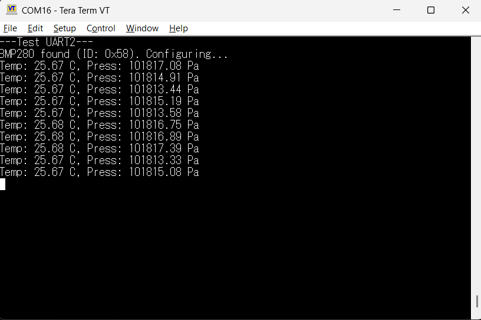
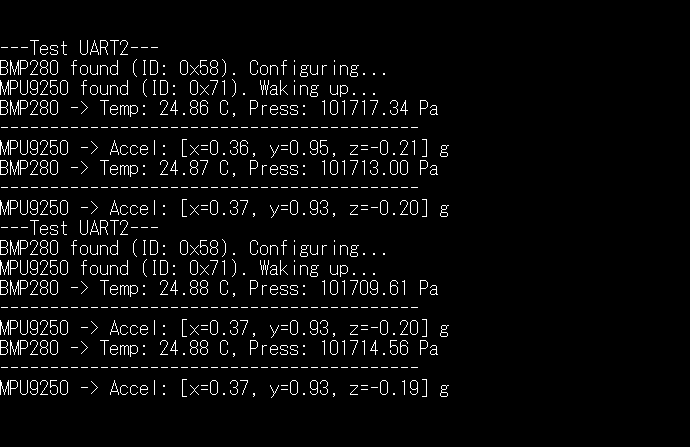
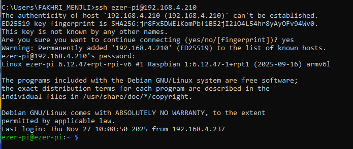
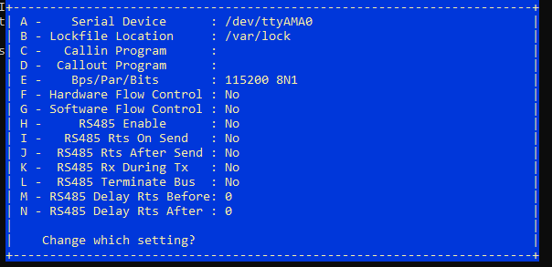
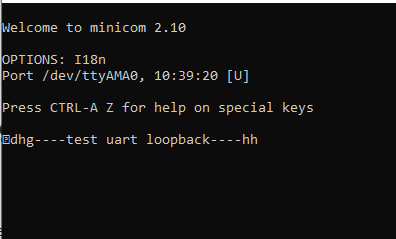
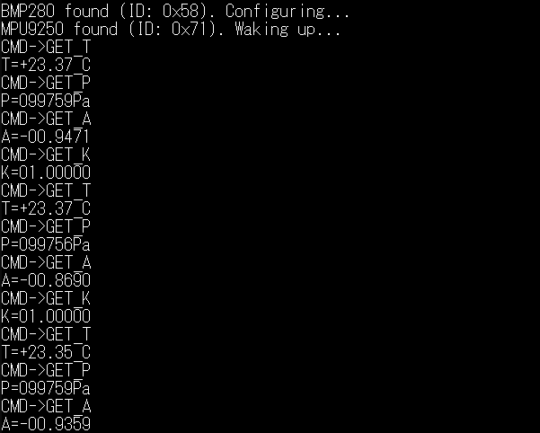
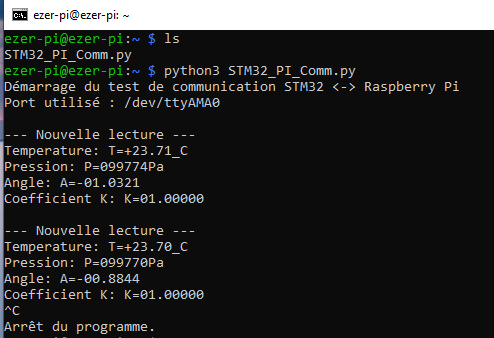
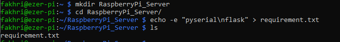
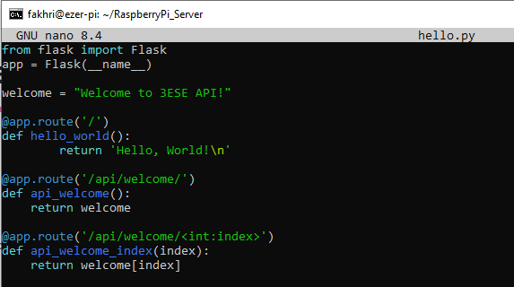

# 25_26_TP_Capteurs_Bus_Soltani-Menjli
## Réaliser par :
- Ezer SOLTANI
- Fakhri MENJLI
## Objectif de TP:
mettre en place l'ensemble des composants suivant:


 ## TP 1:Bus I2C
 ### Capteur BMP280 :
1. les adresses I²C possibles pour ce composant:
   * 0x76 : lorsque SDO est connecté à la masse (GND).
   * 0x77 : lorsque SDO est connecté à la tension d'alimentation (VDD).
2. le registre et la valeur permettant d'identifier ce composant:
   * l'adresse 0xD0 et la valeur est 0x58.
3. le registre et la valeur permettant de placer le composant en mode normal
   * Le registre ctrl_meas à l'adresse 0xF4 et Les bits doivent être à "11" en Mode normale.
4. Registres d’étalonnage du composant :
   * Les valeurs d’étalonnage sont stockées dans les registres calib00 à calib25, correspondant aux adresses mémoire allant de 0x88 à 0xA1.
5. Registres contenant la température (et leur format) :Les données de température sont réparties sur trois registres :
   * temp_msb à l’adresse 0xFA : contient les bits 15 à 8,
   * temp_lsb à l’adresse 0xFB : contient les bits 7 à 0,
   * temp_xlsb à l’adresse 0xFC : contient les bits 7 à 4   
6. Registres contenant la pression (et leur format) :Les données de pression sont réparties sur trois registres :
   * press_msb à l’adresse 0xF7 : contient les bits 15 à 8,
   * press_lsb à l’adresse 0xF8 : contient les bits 7 à 0,
   * press_xlsb à l’adresse 0xF9 : contient les bits 7 à 4
7. les fonctions permettant le calcul de la température et de la pression compensées, en format entier 32 bits:

## Fonction de lecture Température / Pression – BMP280

```c
void BMP280_ReadTemperaturePressure(float *temp, float *press)
{
    uint8_t tx_data = BMP280_REG_PRESS_MSB;
    uint8_t rx_data[6]; // Press_MSB, Press_LSB, Press_XLSB, Temp_MSB, Temp_LSB, Temp_XLSB
    int32_t adc_P, adc_T;

    // Read data from 0xF7
    HAL_I2C_Master_Transmit(&hi2c1, BMP280_I2C_ADDR, &tx_data, 1, HAL_MAX_DELAY);
    HAL_I2C_Master_Receive(&hi2c1, BMP280_I2C_ADDR, rx_data, 6, HAL_MAX_DELAY);

    adc_P = (rx_data[0] << 12) | (rx_data[1] << 4) | (rx_data[2] >> 4);
    adc_T = (rx_data[3] << 12) | (rx_data[4] << 4) | (rx_data[5] >> 4);

    // --- Temperature Compensation
    int32_t var1, var2, T;
    var1 = ((((adc_T >> 3) - ((int32_t)calibData.dig_T1 << 1))) * ((int32_t)calibData.dig_T2)) >> 11;
    var2 = (((((adc_T >> 4) - ((int32_t)calibData.dig_T1)) * ((adc_T >> 4) - ((int32_t)calibData.dig_T1))) >> 12) * ((int32_t)calibData.dig_T3)) >> 14;
    t_fine = var1 + var2;
    T = (t_fine * 5 + 128) >> 8;
    *temp = T / 100.0f;

    // --- Pressure Compensation
    int64_t p_var1, p_var2, p;
    p_var1 = (int64_t)t_fine - 128000;
    p_var2 = p_var1 * p_var1 * (int64_t)calibData.dig_P6;
    p_var2 = p_var2 + ((p_var1 * (int64_t)calibData.dig_P5) << 17);
    p_var2 = p_var2 + (((int64_t)calibData.dig_P4) << 35);
    p_var1 = ((p_var1 * p_var1 * (int64_t)calibData.dig_P3) >> 8) + ((p_var1 * (int64_t)calibData.dig_P2) << 12);
    p_var1 = (((((int64_t)1) << 47) + p_var1)) * ((int64_t)calibData.dig_P1) >> 33;

    p = 1048576 - adc_P;
    p = (((p << 31) - p_var2) * 3125) / p_var1;

    p_var1 = (((int64_t)calibData.dig_P9) * (p >> 13) * (p >> 13)) >> 25; 
    p_var2 = (((int64_t)calibData.dig_P8) * p) >> 19;

    p = ((p + p_var1 + p_var2) >> 8) + (((int64_t)calibData.dig_P7) << 4);

    *press = (float)p / 256.0f;
}
```
### Communication I²C
#### Identification du BMP280

```c
void BMP280_Init(void)
{
    uint8_t id = BMP280_ReadID();
    printf("BMP280 found (ID: 0x%02X). Configuring...\r\n", id);
    BMP280_ReadCalibration();
    BMP280_Config();
}
```

**Vérification du configuration**


**Résultats obtenus après l’interfaçage du capteur BMP280**



### Capteur MPU9250 :
**Fonction de lecture accélerometre MPU9250**
```c
void MPU9250_ReadAccel(MPU9250_Data *data)
{
    uint8_t rx_data[6];
    int16_t raw_x, raw_y, raw_z;

    HAL_I2C_Mem_Read(&hi2c1, MPU9250_I2C_ADDR, MPU9250_REG_ACCEL_XOUT_H, 1, rx_data, 6, HAL_MAX_DELAY);

    raw_x = (int16_t)((rx_data[0] << 8) | rx_data[1]);
    raw_y = (int16_t)((rx_data[2] << 8) | rx_data[3]);
    raw_z = (int16_t)((rx_data[4] << 8) | rx_data[5]);

    data->Accel_X = raw_x / 16384.0f;
    data->Accel_Y = raw_y / 16384.0f;
    data->Accel_Z = raw_z / 16384.0f;
}
```
**Résultat final**



 ## TP2 : Interfaçage STM32 - Raspberry
 ### Objectif: Permettre l'interrogation du STM32 via un Raspberry Pi Zero Wifi
 
 

 #### Premier démarrage
**Connexion SSH :**


 
Nous avons réussi la connexion SSH au Raspberry Pi : l’authentification s’est faite avec succès et nous avons maintenant accès au terminal.

**Configuration et test avec minicom :**

  * installation minicom

```c
sudo apt update
sudo apt install minicom
```

  * configuration minicom

 

#### Port Série
  * Loopback :

    Nous avons réalisé une boucle locale sur le port série du Raspberry Pi en reliant la broche RX à la broche TX. Ensuite, nous avons utilisé le logiciel minicom afin de tester le bon fonctionnement du port série.
    


  * Implémentation du protocole sur la STM32 :

    Le code suivant gère les commandes reçues via l’UART et génère les réponses associées:

```c
void ProcessCommand(void)
{
	char txBuffer[64];
	float temp, press;

	if (strcmp(rxBuffer, "GET_T") == 0)
	{
		BMP280_ReadTemperaturePressure(&temp, &press);
		sprintf(txBuffer, "T=%+06.2f_C\r\n", temp);
		printf(txBuffer);
		HAL_UART_Transmit(&huart1, (uint8_t*)txBuffer, strlen(txBuffer), 100);
	}
	else if (strcmp(rxBuffer, "GET_P") == 0)
	{
		BMP280_ReadTemperaturePressure(&temp, &press);
		sprintf(txBuffer, "P=%06.0fPa\r\n", press);
		printf(txBuffer);
		HAL_UART_Transmit(&huart1, (uint8_t*)txBuffer, strlen(txBuffer), 100);
	}
	else if (strncmp(rxBuffer, "SET_K=", 6) == 0)
	{
		int k_val;
		if (sscanf(rxBuffer + 6, "%d", &k_val) == 1)
		{
			K_coeff = k_val / 100.0f;
			sprintf(txBuffer, "SET_K=OK\r\n");
		}
		else
		{
			sprintf(txBuffer, "SET_K=ERR\r\n");
		}
		printf(txBuffer);
		HAL_UART_Transmit(&huart1, (uint8_t*)txBuffer, strlen(txBuffer), 100);
	}
	else if (strcmp(rxBuffer, "GET_K") == 0)
	{
		sprintf(txBuffer, "K=%08.5f\r\n", K_coeff);
		printf(txBuffer);
		HAL_UART_Transmit(&huart1, (uint8_t*)txBuffer, strlen(txBuffer), 100);
	}
	else if (strcmp(rxBuffer, "GET_A") == 0)
	{
		MPU9250_Data mpu;
		MPU9250_ReadAccel(&mpu);
		float angle = atan2f(mpu.Accel_X, sqrtf(mpu.Accel_Y * mpu.Accel_Y + mpu.Accel_Z * mpu.Accel_Z)) * 180.0f / 3.14159f;
		sprintf(txBuffer, "A=%08.4f\r\n", angle);
		printf(txBuffer);
		HAL_UART_Transmit(&huart1, (uint8_t*)txBuffer, strlen(txBuffer), 100);
	}
}
```

Essais réalisés depuis le Raspberry Pi :


 

  * Commande depuis un script Python :

le script est dans le fichier  "STM32_PI_Comm.py"

```c
# Boucle de test principale
if __name__ == "__main__":
    print("Démarrage du test de communication STM32 <-> Raspberry Pi")
    print(f"Port utilisé : {ser.name}")
    
    try:
        while True:
            print("\n--- Nouvelle lecture ---")
            get_temperature()
            get_pressure()
            get_angle()
            get_k()

            time.sleep(1)
            
    except KeyboardInterrupt:
        print("\nArrêt du programme.")
        ser.close()
```
		
 

## TP3 - Interface REST
Nous avons créé un répertoire dédié au développement du serveur et y avons ajouté un fichier "requirements.txt".

 

 ### Premier fichier Web

 Nous avons créé un fichier hello.py au sein du répertoire ~/RaspberryPi_server:
 
 


    
