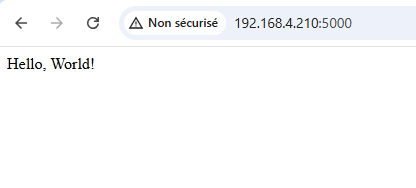
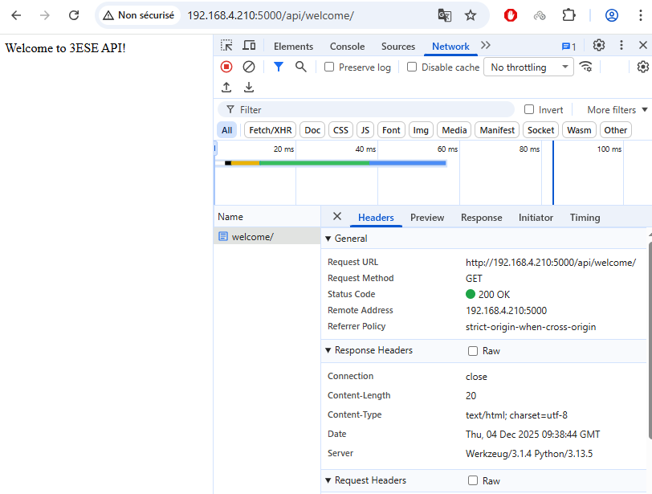
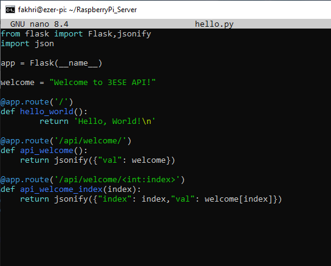
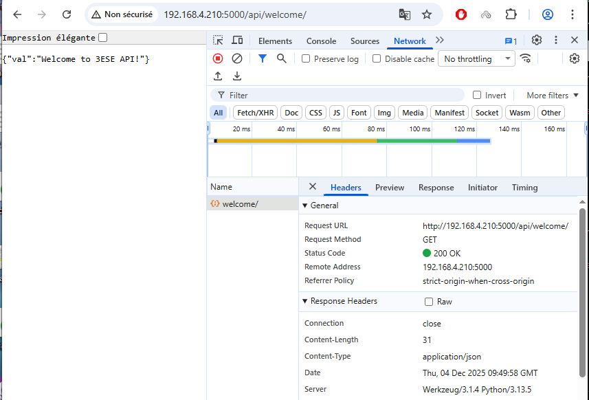
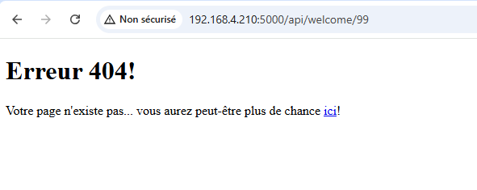
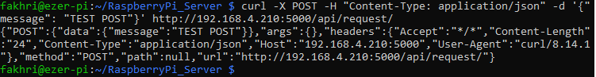
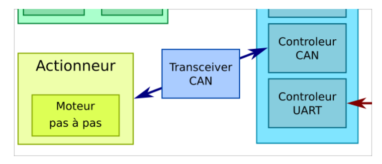
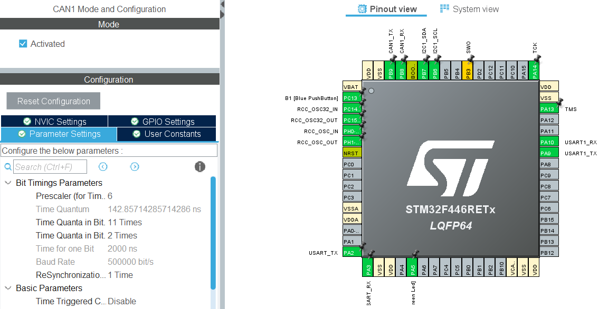
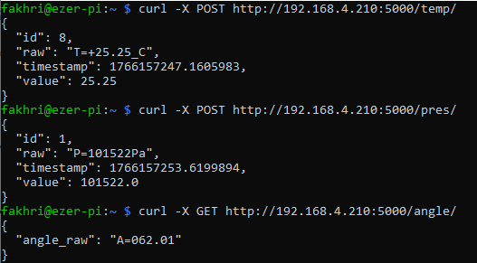
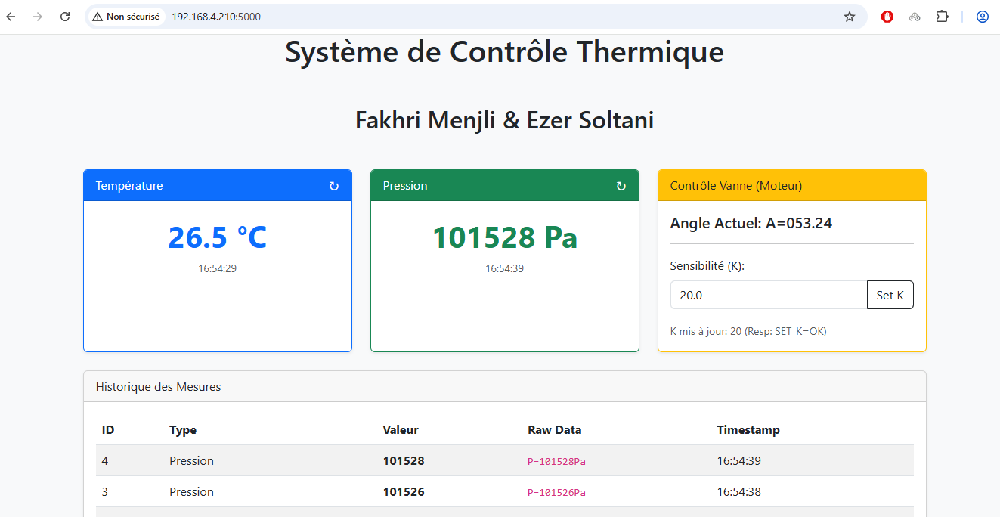

# 25_26_TP_Capteurs_Bus_Soltani-Menjli
## Réaliser par :
- Ezer SOLTANI
- Fakhri MENJLI
## Objectif de TP:
mettre en place l'ensemble des composants suivant:


 ## TP 1:Bus I2C
 ### Capteur BMP280 :
1. les adresses I²C possibles pour ce composant:
   * 0x76 : lorsque SDO est connecté à la masse (GND).
   * 0x77 : lorsque SDO est connecté à la tension d'alimentation (VDD).
2. le registre et la valeur permettant d'identifier ce composant:
   * l'adresse 0xD0 et la valeur est 0x58.
3. le registre et la valeur permettant de placer le composant en mode normal
   * Le registre ctrl_meas à l\'adresse 0xF4 et Les bits doivent être à "11" en Mode normale.
4. Registres d’étalonnage du composant :
   * Les valeurs d’étalonnage sont stockées dans les registres calib00 à calib25, correspondant aux adresses mémoire allant de 0x88 à 0xA1.
5. Registres contenant la température (et leur format) :Les données de température sont réparties sur trois registres :
   * temp_msb à l’adresse 0xFA : contient les bits 15 à 8,
   * temp_lsb à l’adresse 0xFB : contient les bits 7 à 0,
   * temp_xlsb à l’adresse 0xFC : contient les bits 7 à 4   
6. Registres contenant la pression (et leur format) :Les données de pression sont réparties sur trois registres :
   * press_msb à l’adresse 0xF7 : contient les bits 15 à 8,
   * press_lsb à l’adresse 0xF8 : contient les bits 7 à 0,
   * press_xlsb à l’adresse 0xF9 : contient les bits 7 à 4
7. les fonctions permettant le calcul de la température et de la pression compensées, en format entier 32 bits:

## Fonction de lecture Température / Pression – BMP280

```c
void BMP280_ReadTemperaturePressure(float *temp, float *press)
{
    uint8_t tx_data = BMP280_REG_PRESS_MSB;
    uint8_t rx_data[6]; // Press_MSB, Press_LSB, Press_XLSB, Temp_MSB, Temp_LSB, Temp_XLSB
    int32_t adc_P, adc_T;

    // Read data from 0xF7
    HAL_I2C_Master_Transmit(&hi2c1, BMP280_I2C_ADDR, &tx_data, 1, HAL_MAX_DELAY);
    HAL_I2C_Master_Receive(&hi2c1, BMP280_I2C_ADDR, rx_data, 6, HAL_MAX_DELAY);

    adc_P = (rx_data[0] << 12) | (rx_data[1] << 4) | (rx_data[2] >> 4);
    adc_T = (rx_data[3] << 12) | (rx_data[4] << 4) | (rx_data[5] >> 4);

    // --- Temperature Compensation
    int32_t var1, var2, T;
    var1 = ((((adc_T >> 3) - ((int32_t)calibData.dig_T1 << 1))) * ((int32_t)calibData.dig_T2)) >> 11;
    var2 = (((((adc_T >> 4) - ((int32_t)calibData.dig_T1)) * ((adc_T >> 4) - ((int32_t)calibData.dig_T1))) >> 12) * ((int32_t)calibData.dig_T3)) >> 14;
    t_fine = var1 + var2;
    T = (t_fine * 5 + 128) >> 8;
    *temp = T / 100.0f;

    // --- Pressure Compensation
    int64_t p_var1, p_var2, p;
    p_var1 = (int64_t)t_fine - 128000;
    p_var2 = p_var1 * p_var1 * (int64_t)calibData.dig_P6;
    p_var2 = p_var2 + ((p_var1 * (int64_t)calibData.dig_P5) << 17);
    p_var2 = p_var2 + (((int64_t)calibData.dig_P4) << 35);
    p_var1 = ((p_var1 * p_var1 * (int64_t)calibData.dig_P3) >> 8) + ((p_var1 * (int64_t)calibData.dig_P2) << 12);
    p_var1 = (((((int64_t)1) << 47) + p_var1)) * ((int64_t)calibData.dig_P1) >> 33;

    p = 1048576 - adc_P;
    p = (((p << 31) - p_var2) * 3125) / p_var1;

    p_var1 = (((int64_t)calibData.dig_P9) * (p >> 13) * (p >> 13)) >> 25; 
    p_var2 = (((int64_t)calibData.dig_P8) * p) >> 19;

    p = ((p + p_var1 + p_var2) >> 8) + (((int64_t)calibData.dig_P7) << 4);

    *press = (float)p / 256.0f;
}
```
### Communication I²C
#### Identification du BMP280

```c
void BMP280_Init(void)
{
    uint8_t id = BMP280_ReadID();
    printf("BMP280 found (ID: 0x%02X). Configuring...\r\n", id);
    BMP280_ReadCalibration();
    BMP280_Config();
}
```

**Vérification du configuration**


**Résultats obtenus après l’interfaçage du capteur BMP280**


### Capteur MPU9250 :
**Fonction de lecture accélerometre MPU9250**
```c
void MPU9250_ReadAccel(MPU9250_Data *data)
{
    uint8_t rx_data[6];
    int16_t raw_x, raw_y, raw_z;

    HAL_I2C_Mem_Read(&hi2c1, MPU9250_I2C_ADDR, MPU9250_REG_ACCEL_XOUT_H, 1, rx_data, 6, HAL_MAX_DELAY);

    raw_x = (int16_t)((rx_data[0] << 8) | rx_data[1]);
    raw_y = (int16_t)((rx_data[2] << 8) | rx_data[3]);
    raw_z = (int16_t)((rx_data[4] << 8) | rx_data[5]);

    data->Accel_X = raw_x / 16384.0f;
    data->Accel_Y = raw_y / 16384.0f;
    data->Accel_Z = raw_z / 16384.0f;
}
```
**Résultat final**


 ## TP2 : Interfaçage STM32 - Raspberry
 ### Objectif: Permettre l\'interrogation du STM32 via un Raspberry Pi Zero Wifi
 
 

 #### Premier démarrage
**Connexion SSH :**


 
 Nous avons réussi la connexion SSH au Raspberry Pi : l\'authentification s\'est faite avec succès et nous avons maintenant accès au terminal.

**Configuration et test avec minicom :**

  * installation minicom

```c
sudo apt update
sudo apt install minicom
```

  * configuration minicom

 

#### Port Série
  * Loopback :

    Nous avons réalisé une boucle locale sur le port série du Raspberry Pi en reliant la broche RX à la broche TX. Ensuite, nous avons utilisé le logiciel minicom afin de tester le bon fonctionnement du port série.
    


  * Implémentation du protocole sur la STM32 :

    Le code suivant gère les commandes reçues via l\'UART et génère les réponses associées:

```c
void ProcessCommand(void)
{
	char txBuffer[64];
	float temp, press;

	if (strcmp(rxBuffer, "GET_T") == 0)
	{
		BMP280_ReadTemperaturePressure(&temp, &press);
		sprintf(txBuffer, "T=%+06.2f_C\r\n", temp);
		printf(txBuffer);
		HAL_UART_Transmit(&huart1, (uint8_t*)txBuffer, strlen(txBuffer), 100);
	}
	else if (strcmp(rxBuffer, "GET_P") == 0)
	{
		BMP280_ReadTemperaturePressure(&temp, &press);
		sprintf(txBuffer, "P=%06.0fPa\r\n", press);
		printf(txBuffer);
		HAL_UART_Transmit(&huart1, (uint8_t*)txBuffer, strlen(txBuffer), 100);
	}
	else if (strncmp(rxBuffer, "SET_K=", 6) == 0)
	{
		int k_val;
		if (sscanf(rxBuffer + 6, "%d", &k_val) == 1)
		{
			K_coeff = k_val / 100.0f;
			sprintf(txBuffer, "SET_K=OK\r\n");
		}
		else
		{
			sprintf(txBuffer, "SET_K=ERR\r\n");
		}
		printf(txBuffer);
		HAL_UART_Transmit(&huart1, (uint8_t*)txBuffer, strlen(txBuffer), 100);
	}
	else if (strcmp(rxBuffer, "GET_K") == 0)
	{
		sprintf(txBuffer, "K=%08.5f\r\n", K_coeff);
		printf(txBuffer);
		HAL_UART_Transmit(&huart1, (uint8_t*)txBuffer, strlen(txBuffer), 100);
	}
	else if (strcmp(rxBuffer, "GET_A") == 0)
	{
		MPU9250_Data mpu;
		MPU9250_ReadAccel(&mpu);
		float angle = atan2f(mpu.Accel_X, sqrtf(mpu.Accel_Y * mpu.Accel_Y + mpu.Accel_Z * mpu.Accel_Z)) * 180.0f / 3.14159f;
		sprintf(txBuffer, "A=%08.4f\r\n", angle);
		printf(txBuffer);
		HAL_UART_Transmit(&huart1, (uint8_t*)txBuffer, strlen(txBuffer), 100);
	}
}
```

Essais réalisés depuis le Raspberry Pi :


 

  * Commande depuis un script Python :

le script est dans le fichier  "STM32_PI_Comm.py"

```c
# Boucle de test principale
if __name__ == "__main__":
    print("Démarrage du test de communication STM32 <-> Raspberry Pi")
    print(f"Port utilisé : {ser.name}")
    
    try:
        while True:
            print("\n--- Nouvelle lecture ---")
            get_temperature()
            get_pressure()
            get_angle()
            get_k()

            time.sleep(1)
            
    except KeyboardInterrupt:
        print("\nArrêt du programme.")
        ser.close()
```
		
 

## TP3 - Interface REST
Nous avons créé un répertoire dédié au développement du serveur et y avons ajouté un fichier "requirements.txt".

 

### Premier fichier Web

Nous avons créé un fichier hello.py au sein du répertoire ~/RaspberryPi_server:

```c
from flask import Flask
app = Flask(__name__)

@app.route('/')
def hello_world():
    return 'Hello, World!\n'
```

Test du serveur:



**Quel est le rôle du décorateur @app.route ?**

Le décorateur @app.route sert à associer une URL (une route) à une fonction Python.
Lorsque le serveur reçoit une requête correspondant à cette URL, Flask exécute automatiquement la fonction liée.
Autrement dit, il permet de définir quelles pages ou quelles ressources seront accessibles via votre API.

**Quel est le rôle du fragment <int:index> ?**

Le fragment <int:index> indique à Flask que la route doit contenir une variable nommée index, qui doit être un entier.
Flask récupère alors cette valeur dans l’URL (par exemple /api/welcome/3) et la transmet comme argument à la fonction Python api_welcome_index(index).

Cela permet donc de créer des routes dynamiques, capables de traiter des valeurs variables provenant de l’URL.

### Première page REST
**Réponse JSON**

Solution 1:


Test du serveur:



Remarque :On peut remarquer que, par défaut, la réponse n’est pas au format JSON mais en HTML.

Solution 2:



Test du serveur:



Remarque :Cette solution est préférable car elle utilise jsonify : le contenu Python est automatiquement converti en JSON, ce qui garantit que la réponse de l’API est correctement formatée.

**Ajout de la gestion des erreurs 404**

Nous avons implémenté la gestion des erreurs 404 dans hello.py afin de renvoyer un message approprié lorsqu’une route inexistante est sollicitée.

```c
from flask import Flask,jsonify,abort,render_template,request
import json

app = Flask(__name__)

welcome = "Welcome to 3ESE API!"

@app.errorhandler(404)
def page_not_found(error):
    return render_template('page_not_found.html'), 404

@app.route('/')
def hello_world():
	return 'Hello, World!\n'
```

Test du serveur:



### Méthodes POST, PUT, DELETE…
**API CRUD**
Le script est dans le fichier "RaspberryPi_Server/templates/hello.py"

Test du script:




## TP4 - Bus CAN
### Objectif : 

Concevoir et développer une API REST pour l’échange de données, tout en mettant en place et testant un périphérique connecté sur le bus CAN.



### Configuration du bus CAN sur CubeMX:



### Pilotage du Moteur Pas-à-Pas
Pour piloter le moteur via le bus CAN, nous envoyons des trames avec un ID spécifique. Voici la fonction permettant de définir l\'angle du moteur :

```c
void Stepper_SetAngle(uint8_t angle, uint8_t sign)
{
    CAN_TxHeaderTypeDef TxHeader;
    uint8_t TxData[8];
    uint32_t TxMailbox;

    TxHeader.StdId = 0x61; // ID pour l\'angle
    TxHeader.ExtId = 0;
    TxHeader.IDE = CAN_ID_STD;
    TxHeader.RTR = CAN_RTR_DATA;
    TxHeader.DLC = 2; // 2 octets de données
    TxHeader.TransmitGlobalTime = DISABLE;

    TxData[0] = angle; // Angle en degrés (0-90)
    TxData[1] = sign;  // Sens de rotation

    if (HAL_CAN_AddTxMessage(&hcan1, &TxHeader, TxData, &TxMailbox) != HAL_OK)
    {
        Error_Handler();
    }
}
```

# TP 5 : Intégration du Système Complet

## Objectif
Fusionner les briques I2C, UART, CAN et REST pour obtenir un système connecté complet :
1. Le STM32 lit la température (BMP280).
2. Il pilote l\'ouverture d\'une vanne (Moteur CAN) proportionnellement à la température (`Angle = (Temp - Cible) * K`).
3. Le Raspberry Pi interroge le STM32 via UART et expose les données sur une API REST.

## Architecture Logicielle (STM32)
**Boucle principale non-bloquante :**
```c
  while (1)
  {
    // 1. Traitement des commandes UART (si drapeau levé par l\'ISR)
    if (cmdReceived) {
        ProcessCommand();
        cmdReceived = 0;
    }

    // 2. Tâche périodique (10Hz) : Lecture Capteur + Asservissement Moteur
    if (HAL_GetTick() - lastTick >= 100) {
        lastTick = HAL_GetTick();

        // Lecture I2C
        BMP280_ReadTemperaturePressure(&current_temp, &current_press);

        // Calcul de l\'angle (Loi de commande Proportionnelle)
        float error = current_temp - TEMP_TARGET; // Mode Refroidissement
        float calculated_angle = error * K_coeff;

        // Envoi CAN
        Stepper_SetAngle((uint8_t)calculated_angle, 0);
    }
  }
```

## Architecture Serveur (Raspberry Pi)
Le serveur utilise `Flask` pour l\'API et `pyserial` pour communiquer avec le STM32. L\'accès au port série est protégé par un `threading.Lock` pour éviter les collisions.

**Extrait du fichier `app.py` (Route GET/POST Température) :**
```python
@app.route('/temp/', methods=['POST'])
def create_temp():
    """ Demande une nouvelle mesure au STM32 via UART """ 
    resp = send_stm32_command("GET_T") # Envoie "GET_T", reçoit "T=+24.50_C"
    
    # Parsing et stockage
    val = parse_temp(resp) 
    new_entry = {"id": len(temp_history), "value": val, "raw": resp}
    temp_history.append(new_entry)
    
    return jsonify(new_entry), 201

@app.route('/scale/<float:val>', methods=['POST'])
def update_scale(val):
    """ Met à jour le coefficient K du STM32 """ 
    cmd = f"SET_K={val:.2f}"
    resp = send_stm32_command(cmd)
    return jsonify({"scale": val, "stm32_resp": resp})
```

## Résultat Final
Le système fonctionne de manière autonome.
1. Une requête `POST /scale/10.0` augmente la sensibilité du moteur.
2. Une requête `POST /temp/` récupère la température actuelle.
3. Si on chauffe le capteur, le moteur tourne automatiquement.

**Test de l'API REST (Température, Pression, Angle) via Curl :**



### Bonus : Dashboard Web de Contrôle
Pour faciliter l'interaction avec le système sans passer par la ligne de commande, nous avons développé une interface Web (Dashboard) servie par Flask.

Cette page permet de :
*   Visualiser la température et la pression en temps réel.
*   Voir l'historique des mesures.
*   Piloter la sensibilité du moteur (Coefficient K) directement via un formulaire.

**Aperçu du Dashboard :**


